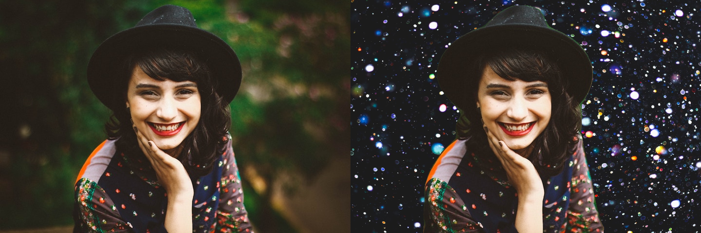
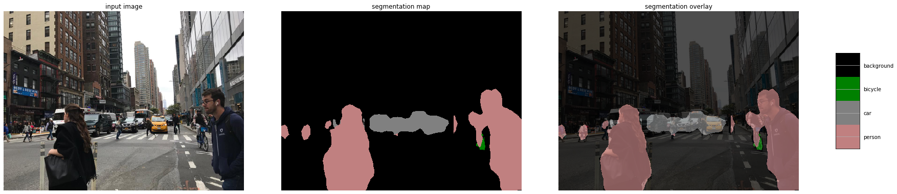
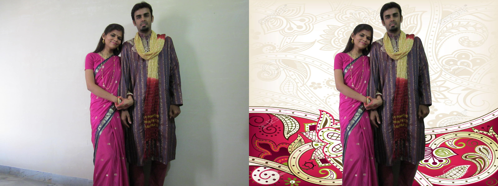
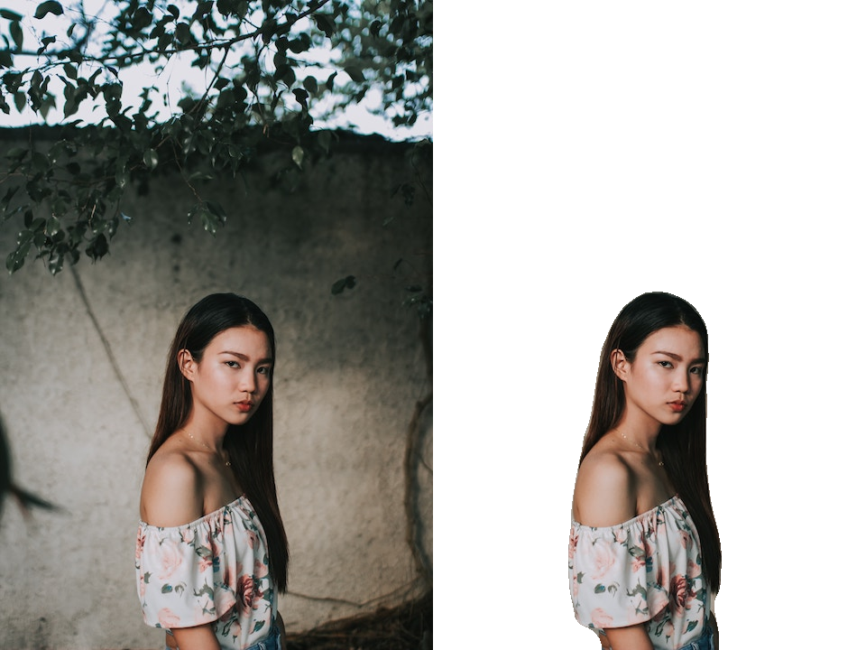
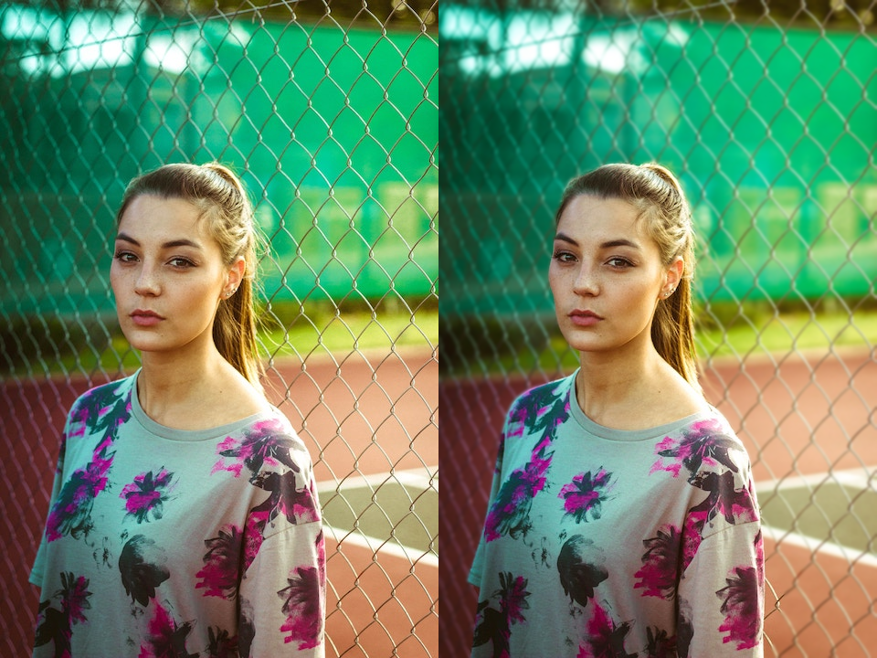
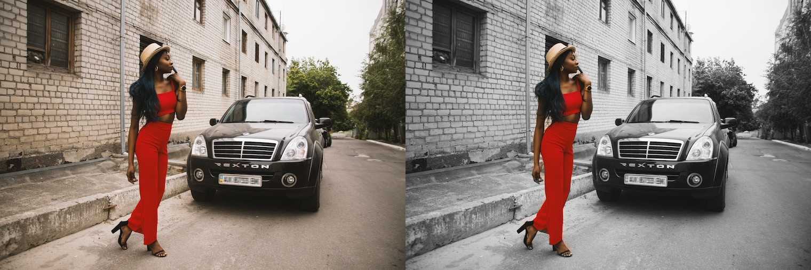

# Whiten/Customize the background of images using Semantic Segmentation and Alpha Blending


Have you ever wanted to whiten/change the background of your image without going crazy over photoshop? Well, enter Semantic Segmentation. Semantic Segmentation is an image analysis task in which we classify each pixel in the image into a class. Similar to what us humans do all the time by default, when are looking then whatever we are seeing if we think of that as an image then we know what class each pixel of the image belongs to. Essentially, Semantic Segmentation is the technique through which we can achieve this in Computers. There are a few more types of Segmentation, you can read about it more here.
I am using DeepLabV3 for achieving semantic segmentation and alpha blending to blend a new background with the original image.



DeepLab is a Semantic Segmentation Architecture that came out of Google Brain. It is a state-of-art deep learning model for semantic image segmentation, where the goal is to assign semantic labels (e.g., person, dog, cat and so on) to every pixel in the input image. Current implementation includes the following features: DeepLabv1: use atrous convolution to explicitly control the resolution at which feature responses are computed within Deep Convolutional Neural Networks; DeepLabv2: using atrous spatial pyramid pooling (ASPP) to robustly segment objects at multiple scales with filters at multiple sampling rates and effective fields-of-views; DeepLabv3: augment the ASPP module with image-level feature to capture longer range information. This also includes batch normalization parameters to facilitate the training. In particular, by applying atrous convolution to extract output features at different output strides during training and evaluation efficiently enables training BN at output stride = 16 and attains a high performance at output stride = 8 during evaluation. If you want to learn more about DeepLab, it can be found here.
  
## 1. Common utility code across whitening/customizing the image background
I have used Google CoLab for the task as I do not have GPU availability on my personal machine. I saved all images and colab notebooks in google drive. These resources can then be easily accessed using the below two lines. Additionally, if you save your intermediate work, it’s always safe in your gdrive.
```
from google.colab import drive
drive.mount('/content/drive')
```
### 1.1. Load the Image
```
import cv2
img = cv2.imread("/content/drive/My Drive/woman3.jpg", cv2.IMREAD_COLOR)
```
### 1.2. Decode Output — we will use the following function to convert this 2D image to an RGB image where each label is mapped to its corresponding color.
```
#Define the helper function

import numpy as np
def decode_segmap(image, nc=21):
label_colors = np.array([(0, 0, 0),  # 0=background
# 1=aeroplane, 2=bicycle, 3=bird, 4=boat, 5=bottle
(128, 0, 0), (0, 128, 0), (255, 255, 255), (0, 0, 128), (128, 0, 128),
# 6=bus, 7=car, 8=cat, 9=chair, 10=cow
(0, 128, 128), (128, 128, 128), (64, 0, 0), (192, 0, 0), (64, 128, 0),
# 11=dining table, 12=dog, 13=horse, 14=motorbike, 15=person
(192, 128, 0), (64, 0, 128), (192, 0, 128), (64, 128, 128), (255, 255, 255),
# 16=potted plant, 17=sheep, 18=sofa, 19=train, 20=tv/monitor
(0, 64, 0), (128, 64, 0), (0, 192, 0), (128, 192, 0), (0, 64, 128)])
r = np.zeros_like(image).astype(np.uint8)
g = np.zeros_like(image).astype(np.uint8)
b = np.zeros_like(image).astype(np.uint8)
for l in range(0, nc):
idx = image == l
r[idx] = label_colors[l, 0]
g[idx] = label_colors[l, 1]
b[idx] = label_colors[l, 2]
rgb = np.stack([r, g, b], axis=2)
return rgb
```

## 1.3. Pre-process the image and Forward pass through network.
a) In order to get the image into the right format for inference using the model, we need to pre-process it and normalize it. So, for the pre-processing steps, we carry out the following.
Convert it to Tensor — all the values in the image will be scaled so that will lie between [0, 1]instead of the original, [0, 255] range. Normalize it with the Imagenet specific values mean = [0.485, 0.456, 0.406], std = [0.229, 0.224, 0.225]

b) Once the image is preprocessed and ready, it is passed through the model to get the out key. The output of the model is a OrderedDict so we need to take the out key from that to get the output of the model. So, out is the final output of the model.

c) As we see in step 2, the model was trained on 21 classes, hence the output has 21 channels. Now what we need to do is, make this 21 channelled output into a 2D image or a 1 channel image, where each pixel of that image corresponds to a class. So, the 2D image (of shape [H x W]) will have each pixel corresponding to a class label, and thus for each (x, y) pixel in this 2D image will correspond to a number between 0 - 20 representing a class. And how do we get there from this [1 x 21 x H x W]? We take a max index for each pixel position, which represents the class.
```
import matplotlib.pyplot as plt
import torchvision.transforms as T
import torch
from PIL import Image
def segment(net, path, show_orig=True, dev='cuda'):
img = Image.open(path)
if show_orig: 
plt.imshow(img); 
plt.axis('off'); 
plt.show()
# Comment the Resize and CenterCrop for better inference results
trf = T.Compose([T.ToTensor(),
T.Normalize(mean = [0.485, 0.456, 0.406],
std = [0.229, 0.224, 0.225])])
inp = trf(img).unsqueeze(0).to(dev)
out = net.to(dev)(inp)['out']
om = torch.argmax(out.squeeze(), dim=0).detach().cpu().numpy()
rgb = decode_segmap(om)
return rgb
```
### 1.4. Get the deeplabv3_resnet101 from torchvision and run semantic image segmentation in step 3 using the same.
```
from torchvision import models
dlab = models.segmentation.deeplabv3_resnet101(pretrained=1).eval()
rgb=segment(dlab, '/content/drive/My Drive/woman4.jpg')

# If there are multiple labeled objects in the image, use the below code to have only the target as the foreground
rgb[rgb!=255]=0
```
## 2. Customize/Change the background of an image using Alpha blending
Alpha blending is the process of overlaying a foreground image with transparency over a background image. The transparency is often the fourth channel of an image ( e.g. in a transparent PNG), but it can also be a separate image. This transparency mask is often called the alpha mask or the alpha matte. The math behind alpha blending is straight forward. At every pixel of the image, we need to combine the foreground image color and the background image color using the alpha mask.
The foreground image is the original image, the gray scale alpha mask is the result obtained from semantic segmentation in step 1.4, the background image is the custom image which we want to set as the new background.
```
#alpha blending to customize the background of the image
from google.colab import files
# Read the images
foreground = cv2.imread("/content/drive/My Drive/woman3.jpg")
background = cv2.imread("/content/drive/My Drive/light.jpg", cv2.IMREAD_COLOR)
background = cv2.resize(background, (rgb.shape[1],rgb.shape[0]), interpolation = cv2.INTER_AREA)
alpha = rgb
# Convert uint8 to float
foreground = foreground.astype(float)
background = background.astype(float)
# Normalize the alpha mask to keep intensity between 0 and 1
alpha = alpha.astype(float)/255
# Multiply the foreground with the alpha matte
foreground = cv2.multiply(alpha, foreground)
# Multiply the background with ( 1 - alpha )
background = cv2.multiply(1.0 - alpha, background)
# Add the masked foreground and background.
outImage = cv2.add(foreground, background)
# Display image
cv2_imshow(outImage)
cv2.waitKey(0)
# Save/download image
cv2.imwrite('org_plus_cust_bkg_img.png' , outImage)
files.download('org_plus_cust_bkg_img.png')
```
 

## 3. Whiten the background
```
#whiten the background of the image
mask_out=cv2.subtract(rgb,img)
mask_out=cv2.subtract(rgb,mask_out)
mask_out[rgb == 0] = 255
# Display the result
numpy_horizontal = np.hstack((img, mask_out))
numpy_horizontal_concat = np.concatenate((img, mask_out), axis=1)
cv2_imshow(numpy_horizontal_concat)
cv2.waitKey(0)
# Save/download he resulting image
cv2.imwrite('org_plus_white_bkg_image.jpeg',numpy_horizontal_concat)files.download('org_plus_white_bkg_image.jpeg')
```



## 4. Blur the background
We often want to blur the background of our images. The following code can be used to achieve this.
```
# Read the images
foreground = cv2.imread("/content/drive/My Drive/girl8.jpg")
# Create a Gaussian blur of kernel size 7 for the background image
blurredImage = cv2.GaussianBlur(foreground, (7,7), 0)
# Convert uint8 to float
foreground = foreground.astype(float)
blurredImage = blurredImage.astype(float)
# Create a binary mask of the RGB output map using the threshold value 0
th, alpha = cv2.threshold(np.array(rgb),0,255, cv2.THRESH_BINARY)
# Apply a slight blur to the mask to soften edges
alpha = cv2.GaussianBlur(alpha, (7,7),0)
# Normalize the alpha mask to keep intensity between 0 and 1
alpha = alpha.astype(float)/255
# Multiply the foreground with the alpha matte
foreground = cv2.multiply(alpha, foreground)
# Multiply the background with ( 1 - alpha )
background = cv2.multiply(1.0 - alpha, blurredImage)
# Add the masked foreground and background
outImage = cv2.add(foreground, background)
# Return a normalized output image for display
outImage= outImage
numpy_horizontal = np.hstack((img, outImage))
numpy_horizontal_concat = np.concatenate((img, outImage), axis=1)
# Display image
cv2_imshow(numpy_horizontal_concat)
cv2.waitKey(0)
# Save/download the resulting image
cv2.imwrite('res.png' , numpy_horizontal_concat)
files.download('res.png')
```
The resulting image looks like as below.
 

## 5. Grayscale the background
And how about turning your background to grayscale? Well, below is the code to do it.
 

```# Load the foreground input image
foreground = cv2.imread("/content/drive/My Drive/woman-with-car.jpg")
# Resize image to match shape of R-band in RGB output map
foreground = cv2.resize(foreground, (rgb.shape[1],rgb.shape[0]), interpolation = cv2.INTER_AREA)
# Create a background image by copying foreground and converting into grayscale
background = cv2.cvtColor(foreground, cv2.COLOR_BGR2GRAY)
# convert single channel grayscale image to 3-channel grayscale image
background = cv2.cvtColor(background, cv2.COLOR_GRAY2RGB)
# Convert uint8 to float
foreground = foreground.astype(float)
background = background.astype(float)
# Create a binary mask of the RGB output map using the threshold value 0
th, alpha = cv2.threshold(np.array(rgb),0,255, cv2.THRESH_BINARY)
# Apply a slight blur to the mask to soften edges
alpha = cv2.GaussianBlur(alpha, (7,7),0)
# Normalize the alpha mask to keep intensity between 0 and 1
alpha = alpha.astype(float)/255
# Multiply the foreground with the alpha matte
foreground = cv2.multiply(alpha, foreground)
# Multiply the background with ( 1 - alpha )
background = cv2.multiply(1.0 - alpha, background)
# Add the masked foreground and background
outImage = cv2.add(foreground, background)
numpy_horizontal = np.hstack((img, outImage))
numpy_horizontal_concat = np.concatenate((img, outImage), axis=1)
# Display image
cv2_imshow(numpy_horizontal_concat)
cv2.waitKey(0)
# Save image
cv2.imwrite('res.png' , numpy_horizontal_concat)
files.download('res.png')
```

## Conclusion:
I got the motivation to work on this when I used to see pretty profile pictures on LinkedIn with white background but did not want to use photoshop or even little manual editing. What they say, when you are a programmer, you make your code work for you.
As evident from above results, changing or whitening background of images is plausible with the combination of semantic segmentation and alpha blending and the results are not half bad.
You can have this entire code in a python script and by passing two command line arguments — 1)the original image, 2) the new background; you can get your resulting image with a changed background at the click of a finger tip.
As a follow up work, the background of images can be blurred as well as changed to a different scale (for example, grayscale).

## References:
```
Alpha Blending — https://www.learnopencv.com/alpha-blending-using-opencv-cpp-python/
Semantic Segmentation — https://www.learnopencv.com/pytorch-for-beginners-semantic-segmentation-using-torchvision/
DeepLab — https://github.com/tensorflow/models/tree/master/research/deeplab
https://www.learnopencv.com/applications-of-foreground-background-separation-with-semantic-segmentation/
```
Please feel free to comment if you have any queries.
